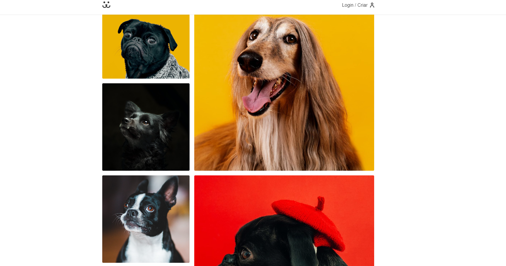
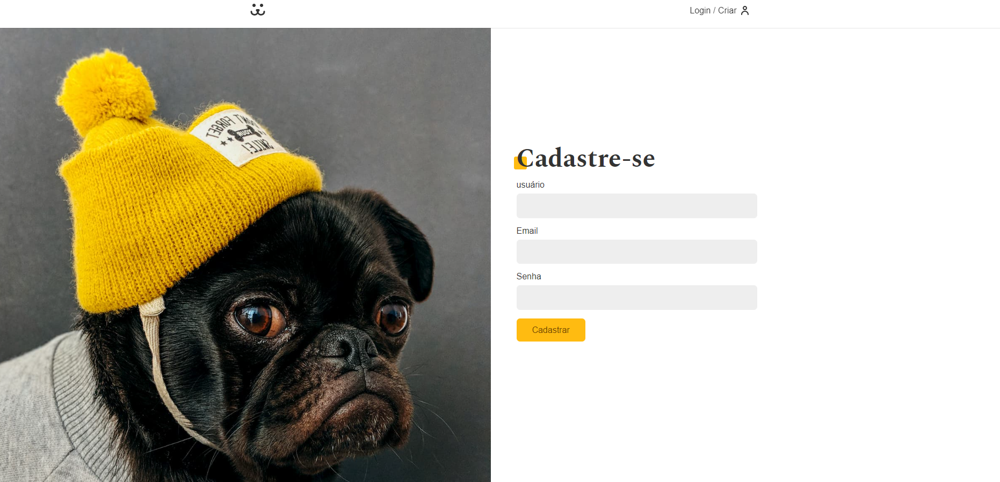
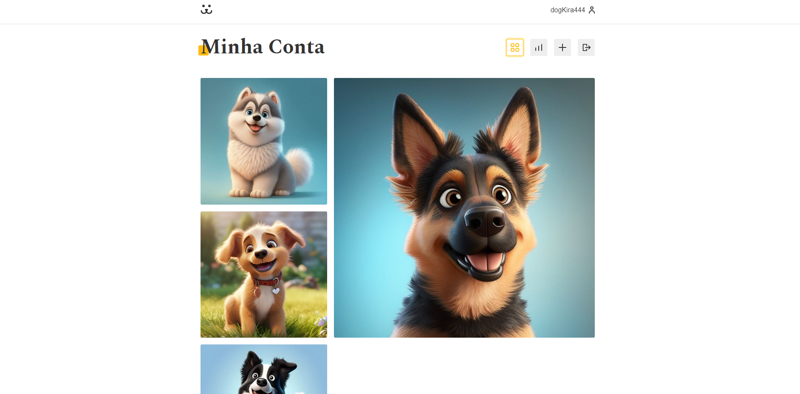
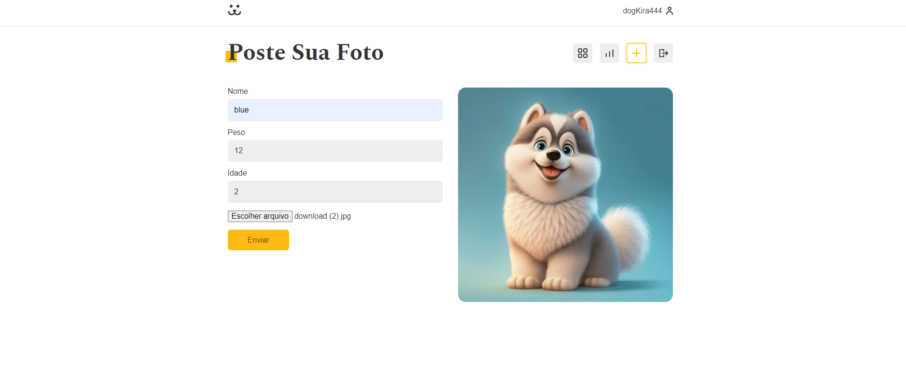
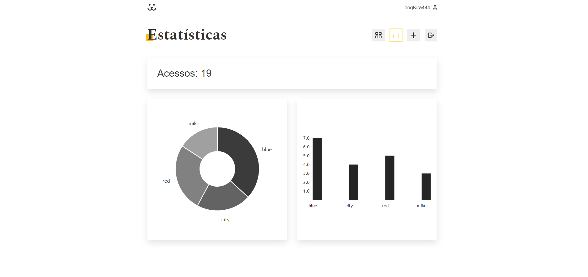
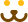

# Social network for dogs

<div align="center" >







</div>

<p>Social network made exclusively for your pet.</p>

<p>
  
  
  
</p>



## Tópicos

[Sobre a aplicação](#Propósito-e-Objetivo)

[Funcionalidades](#funcionalidades)

[Tecnologias e Ferramentas](#tecnologias-e-ferramentas)

[Instalação e uso](#instalação-e-uso)

<br>

## Propósito e Objetivo

A dog é um app feito para os donos de pet. Essa rede foi pensada para você postar fotos do seu pet e interagir com os demais.

🐶É uma aplicação responsiva desenvolvida na conclusão de um mega curso de React Js, na plataforma https://www.origamid.com/. Foram utilizadas as principais funcionalidades da biblioteca, com o intuito de abordar os principais conceitos e boas práticas no desenvolvimento.

<br>

## Funcionalidades

- [x] Cadastro de usuário
- [x] Sistema de login, recuperação e alteração de senha.
- [x] Comentários em publicações de outros usuários.
- [x] Acesso a estatísticas do seu perfil.
- [x] Páginas dinâmicas com React js.

<br>

## Lib

Gráficos criados com a biblioteca <strong>Victory</strong>

<br>

## Tecnologias e Ferramentas

As seguintes tecnologias foram utilizadas no desenvolvimento do projeto:

- [HTML](https://devdocs.io/html/)
- [CSS](https://devdocs.io/css/)
- [JavaScript](https://devdocs.io/javascript/)
- [React Js](https://devdocs.io/Reactjs/)
- [styled-components](https://devdocs.io/styled-components/)
- [Victory](https://devdocs.io/Victory/)

<br>

## Design

O design do nosso app foram cuidadosamente escolhidos para criar uma experiência visualmente atraente e intuitiva para os usuários.

<br>

## Instalação e Uso

Para rodar a aplicação, você precisa instalar o [Node](https://nodejs.org/en/)

Siga os passos abaixo:

```bash
# Abra um terminal e copie este repositório com o comando
$ git clone https://github.com/felipesilv4dev/dog.git
# ou use a opção de download.

# Entre na pasta com
$ cd dog

# Instale as dependências
$ npm install

# Rode a aplicação
$ npm run dev
```

<br>

<strong>Site : https://rede-dogs.netlify.app/</strong>  
<strong>Login Teste : dog</strong>  
<strong>Senha Teste : dog</strong>

---

Feito com :yellow_heart: by [Felipe_Silva](https://github.com/felipeSilv4dev)

 <div align="start">
  <a href='http://www.linkedin.com/in/felipe-silva-1019ab271' target'_blank'>
  <a href="mailto:felipesantana18n@gmail.com" target='_blank'> </a>
</div> 
